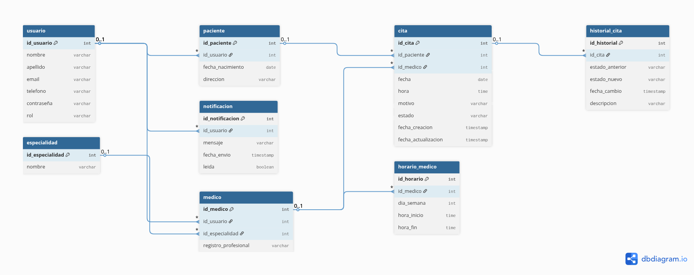
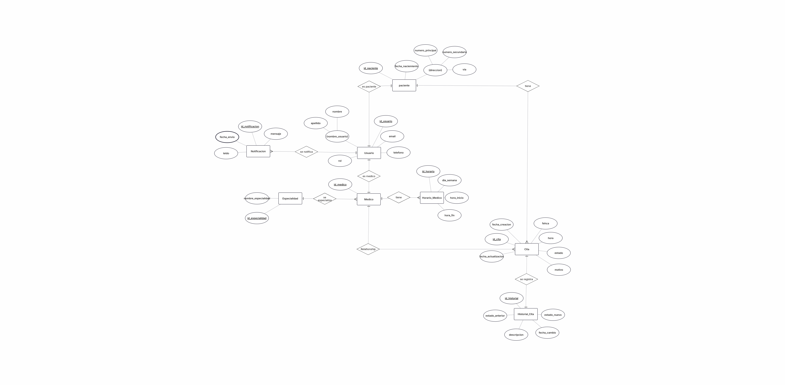

# 🏥 Sistema de Gestión de Citas Médicas

Sistema de gestión de citas médicas para clínicas, desarrollado como proyecto del curso de Bases de Datos 2025-30-2497.

## 📋 Descripción

Proyecto académico que implementa un sistema de gestión de citas médicas utilizando PostgreSQL y Docker.

## 📦 Requisitos

- **Docker**: >= 20.10
- **Docker Compose**: >= 2.0

## 🚀 Instalación Rápida

```bash
# 1. Clonar el repositorio
git clone https://github.com/tu-usuario/clinica-citas-bd.git
cd clinica-citas-bd

# 2. Configurar variables de entorno (opcional)
cp .env.example .env

# 3. Iniciar el sistema
docker-compose up -d

# 4. Verificar que esté funcionando
docker-compose ps
```

## 💻 Comandos Útiles

```bash
# Ver logs
docker-compose logs -f

# Conectarse a la base de datos
docker exec -it clinica-citas-db psql -U clinica_admin -d clinica_citas

# Detener el sistema
docker-compose down

# Reiniciar limpiando datos
docker-compose down -v && docker-compose up -d
```

## 🗄️ Modelo de Datos

### Modelo Entidad-Relación (E-R)



### Modelo Relacional



### Tablas del Sistema

El sistema incluye 8 tablas principales:

1. **USUARIO**: Información de usuarios (admin, médicos, pacientes)
2. **PACIENTE**: Datos específicos de pacientes
3. **MEDICO**: Datos específicos de médicos
4. **ESPECIALIDAD**: Catálogo de especialidades médicas
5. **HORARIO_MEDICO**: Disponibilidad de médicos
6. **CITA**: Registro de citas médicas
7. **HISTORIAL_CITA**: Auditoría de cambios
8. **NOTIFICACION**: Notificaciones del sistema

## 📁 Estructura del Proyecto

```
clinica-citas-bd/
├── app/                        # Aplicación Python
│   ├── config/                 # Configuración
│   ├── database/               # Conexión a base de datos
│   ├── utils/                  # Utilidades
│   ├── Dockerfile              # Imagen Docker de la app
│   ├── main.py                 # Punto de entrada
│   └── requirements.txt        # Dependencias Python
├── db/                         # Base de datos
│   ├── init/
│   │   └── 01-schema.sql       # Esquema de la base de datos
│   └── seed/
│       └── 02-seed-data.sql    # Datos de prueba
├── docs/                       # Documentación
│   ├── clinica_ER.png          # Modelo Relacional
│   ├── clinica_RE.png          # Modelo Entidad-Relación
│   ├── contexto.txt            # Contexto del proyecto
│   └── modelo.txt              # Descripción del modelo
├── .env                        # Variables de entorno
├── .env.example                # Ejemplo de variables
├── .gitignore                  # Archivos ignorados
├── docker-compose.yml          # Configuración de Docker
├── Makefile                    # Comandos útiles
└── README.md                   # Este archivo
```

## 🔑 Acceso a la Base de Datos

- **Host**: localhost:5433
- **Usuario**: clinica_admin
- **Password**: clinica_2025_secure
- **Base de Datos**: clinica_citas

## 👥 Autores

**Curso**: Base de Datos  
**Fecha**: Diciembre 2025

---

**Proyecto Académico** - Universidad del Norte
